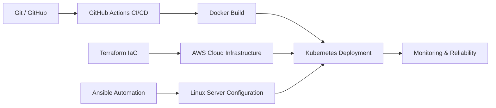

<!--
  SEO-Optimized GitHub Profile README
  Name: Ali Ahmad Raza
  GitHub: https://github.com/Decoder4399
  LinkedIn: https://www.linkedin.com/in/ali-ahmad-raza-devops/
  Email: iamaliraza5955@gmail.com

  Search intent: Ali Ahmad Raza, Ali Ahmad Raza DevOps Engineer,
  Ali Ahmad Raza Cloud Engineer, AWS Terraform Kubernetes India,
  DevOps Engineer India, Cloud Engineer India.
-->

<div align="center">

[](https://github.com/Decoder4399)

# 👋 Hello, I'm Ali Ahmad Raza

### 🚀 DevOps Engineer | Cloud Engineer | AWS | Terraform | Ansible | Kubernetes | CI/CD | Linux Automation

I help teams build reliable, scalable, and automated cloud infrastructure. My work focuses on **AWS cloud services**, **Infrastructure as Code**, **configuration management**, **containerization**, **Kubernetes**, and **CI/CD automation**.

<div align="center">

[](https://github.com/Decoder4399)
[](https://www.linkedin.com/in/ali-ahmad-raza-devops/)
[](mailto:iamaliraza5955@gmail.com)
[](https://www.google.com/maps/search/?api=1&query=India)
[](#)

</div>

</div>

---

## 🔍 Search-Friendly Professional Summary

**Ali Ahmad Raza** is a **DevOps Engineer and Cloud Engineer from India** with hands-on experience in **AWS, Terraform, Ansible, Docker, Kubernetes, GitHub Actions, Linux, Python, Bash, Git, and GitHub**. This profile is optimized for recruiters and hiring managers searching for **Ali Ahmad Raza DevOps Engineer**, **Ali Ahmad Raza Cloud Engineer**, **AWS Terraform Kubernetes projects**, and **DevOps Engineer India**.

### 🎯 Career Snapshot

| Detail | Profile |
|---|---|
| Full Name | **Ali Ahmad Raza** |
| Role | **DevOps Engineer / Cloud Engineer** |
| Location | **India** |
| Core Cloud Platform | **Amazon Web Services (AWS)** |
| Infrastructure as Code | **Terraform** |
| Configuration Management | **Ansible** |
| Containers & Orchestration | **Docker, Kubernetes** |
| CI/CD | **GitHub Actions** |
| Scripting & OS | **Python, Bash, Linux/Ubuntu** |
| Version Control | **Git, GitHub** |
| Career Focus | Cloud Automation, IaC, CI/CD, Kubernetes, Platform Engineering |

---

## 🧠 About Me

I am passionate about **Cloud Computing**, **DevOps**, **Infrastructure Automation**, and **Platform Engineering**. I regularly build practical projects to strengthen my skills in cloud infrastructure, automation, CI/CD, containerization, and Kubernetes.

My approach is simple: **automate repetitive work, document what I build, improve infrastructure reliability, and keep learning modern DevOps practices.**

I also share DevOps, AWS, Terraform, Kubernetes, and automation-related content on LinkedIn to document my learning journey and connect with the cloud community.

---

## 🧭 DevOps Engineering Workflow



---

## 🛠️ Technical Skills

### ☁️ Cloud & DevOps Stack

<table>
  <tr>
    <td align="center" width="120"><br/><b>AWS</b></td>
    <td align="center" width="120"><br/><b>Terraform</b></td>
    <td align="center" width="120"><br/><b>Ansible</b></td>
    <td align="center" width="120"><br/><b>Docker</b></td>
    <td align="center" width="120"><br/><b>Kubernetes</b></td>
    <td align="center" width="120"><br/><b>GitHub Actions</b></td>
  </tr>
</table>

### 💻 Programming, OS & Tools

<table>
  <tr>
    <td align="center" width="120"><br/><b>Linux / Ubuntu</b></td>
    <td align="center" width="120"><br/><b>Python</b></td>
    <td align="center" width="120"><br/><b>Bash</b></td>
    <td align="center" width="120"><br/><b>Git</b></td>
    <td align="center" width="120"><br/><b>GitHub</b></td>
    <td align="center" width="120"><br/><b>VS Code</b></td>
  </tr>
</table>

### 🗄️ Databases

<table>
  <tr>
    <td align="center" width="160"><br/><b>MySQL</b></td>
    <td align="center" width="160"><br/><b>MongoDB</b></td>
  </tr>
</table>

---

## 📊 GitHub Profile Overview

<div align="center">

[](https://github.com/Decoder4399)
[](https://github.com/Decoder4399)

[](https://github.com/Decoder4399)
[](https://github.com/Decoder4399)


</div>

---

## 📈 Contribution Graph

<div align="center">


</div>

---

## 🏗️ Featured Projects

### 1. AWS Infrastructure Provisioning using Terraform

Built AWS cloud infrastructure using **Terraform** as Infrastructure as Code.

**Architecture Components**

- VPC design
- Public and private subnets
- Route tables
- Internet Gateway
- Security groups
- EC2 instance provisioning

**Keywords:** AWS, Terraform, IaC, VPC, Subnets, EC2, Cloud Networking

---

### 2. Ansible Automation Projects

Automated Linux server configuration and operational tasks using **Ansible**.

**Project Highlights**

- Server configuration management
- Package installation automation
- Dynamic inventory setup
- Repeatable environment provisioning

**Keywords:** Ansible, Linux Automation, Configuration Management, Bash, Infrastructure Automation

---

### 3. Kubernetes Cluster Deployment

Deployed and managed a Kubernetes cluster with Ansible-based setup.

**Project Highlights**

- Kubernetes setup using Ansible
- Multi-node cluster deployment
- Application deployment on Kubernetes
- Containerized workload orchestration

**Keywords:** Kubernetes, Docker, Ansible, Multi-Node Cluster, Container Orchestration

---

### 4. CI/CD Projects using GitHub Actions

Created automated build and deployment workflows using **GitHub Actions**.

**Project Highlights**

- GitHub Actions pipelines
- Automated build workflows
- Deployment automation
- Repeatable release processes

**Keywords:** CI/CD, GitHub Actions, DevOps Pipeline, Build Automation, Deployment Automation

---

### 5. Vendor Management System

Developed a role-based application for admin, vendor, and member workflows.

**Project Highlights**

- Firebase Authentication
- Firestore Database
- Role-Based Access Control
- Admin, Vendor, and Member dashboards

**Keywords:** Firebase, Authentication, Firestore, RBAC, Web Application

---

### 6. Finance Tracker Application

Built an Android-based finance tracking application with transaction parsing.

**Project Highlights**

- Android application development
- Kotlin-based implementation
- SMS transaction parsing
- Personal finance tracking workflow

**Keywords:** Android, Kotlin, Mobile App, SMS Parsing, Finance Tracker

---

## 📜 Certifications

> Add verified certifications here as you complete them. This section helps recruiters quickly identify your professional credentials.

| Certification | Platform | Status |
|---|---|---|
| AWS Certified Cloud Practitioner | AWS | In Progress / Planned |
| AWS Certified Solutions Architect — Associate | AWS | Planned |
| HashiCorp Certified: Terraform Associate | HashiCorp | Planned |
| Certified Kubernetes Administrator | Linux Foundation | Planned |

---

## 🧭 Current Learning Focus

I am continuously improving my DevOps and cloud engineering skills through hands-on projects and structured learning.

```text
Ali Ahmad Raza Learning Roadmap
├── Advanced Kubernetes
│   ├── Cluster operations
│   ├── Workloads and networking
│   ├── Helm
│   └── Production deployment patterns
├── GitOps with Argo CD
│   ├── Declarative deployments
│   ├── Application sync strategies
│   ├── Environment promotion
│   └── Git-based release workflows
├── Advanced AWS Services
│   ├── Networking
│   ├── Security
│   ├── Compute
│   ├── Managed services
│   └── Cost optimization
├── Production DevOps Architecture
│   ├── CI/CD maturity
│   ├── Observability
│   ├── Monitoring and alerting
│   ├── Logging
│   └── Reliability engineering
└── Platform Engineering
    ├── Developer experience
    ├── Self-service infrastructure
    ├── Internal developer platforms
    └── Automation-first operations
```

---

## 🌟 Professional Keywords

This profile is written for search visibility around the following terms:

**Ali Ahmad Raza**, **Ali Ahmad Raza DevOps Engineer**, **Ali Ahmad Raza Cloud Engineer**, **DevOps Engineer India**, **Cloud Engineer India**, **AWS Engineer**, **Terraform Engineer**, **Kubernetes Engineer**, **Ansible Automation**, **GitHub Actions CI/CD**, **Infrastructure as Code**, **Cloud Automation**, **Platform Engineering**, **Linux Automation**, **Python Automation**, **Bash Scripting**.

---

## 🔗 Connect With Me

<div align="center">

[](https://github.com/Decoder4399)
[](https://www.linkedin.com/in/ali-ahmad-raza-devops/)
[](mailto:iamaliraza5955@gmail.com)
[](https://www.google.com/maps/search/?api=1&query=India)

</div>

---

<div align="center">

### ⚡ “Automate the repeatable. Secure the foundation. Scale with confidence.”

Thanks for visiting my profile. I’m always open to connecting with recruiters, hiring managers, DevOps engineers, cloud engineers, SREs, and platform engineering communities.

</div>

